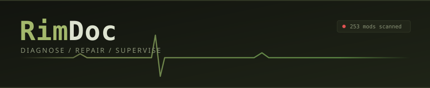

<p align="center">
  
</p>

**Diagnose, repair, and supervise a modded RimWorld install**

RimDoc+ is a desktop companion for large RimWorld mod lists. It reads your install, proves what will break before you press Play, supervises the game while it runs with a structured live log, and turns the wreckage of a crash into a ranked list of causes with repairs attached. Where a mod manager answers "what order do these load in", RimDoc+ answers "why is my colony throwing 40,000 red errors and which of my 253 mods did it".

Built as a Tauri v2 desktop app (Rust + React + TypeScript), with a .NET sidecar for assembly inspection. The parsing and diagnostic layers are pure TypeScript, so the whole rules engine runs headless under `vitest` against fixtures captured from a real install.

> **Design rule:** RimDoc+ never edits a mod in place. Every repair is either an overlay mod that loads after the target or a derived copy in the vault with a diff attached, so the original stays pristine and every change is one click from reverted. Fixes are distributed as recipes applied to your own copy, never as redistributed mod files.

---

## Features (Built)

### Install scan

- Walks the official `Data` folder, local `Mods`, and the Steam Workshop content folder
- Tolerant `About.xml` reader that survives the malformed files a strict XML parser rejects: stray ampersands, mid-file BOMs, unclosed tags, inconsistent casing
- Resolves each mod's own `packageId` correctly even when the file declares `<modDependencies>` above its own identity, which otherwise collapses every Harmony-dependent mod into one entry
- Detects compiled assemblies and XML patch folders, including payloads nested under a version folder such as `1.6/Assemblies`
- Cross-references `ModsConfig.xml` to mark active mods and their load position

### Doctor (L1 static analysis)

Nine independent rules, each provable without launching the game:

- **orphan-active**: enabled package ids with no folder on disk
- **duplicate-package-id**: the same id in two folders, where RimWorld silently picks one
- **dlc-after-mods**: official expansions loading behind third-party content, so mods patched defs that did not exist yet
- **bootstrap-position**: Prepatcher or Harmony loading after a mod that ships C#
- **missing-dependency** and **inactive-dependency**: separated, because one needs an install and the other needs a click
- **incompatible-pair**: both mods enabled where one declares the conflict
- **load-order-violation**: `loadAfter` and `loadBefore` constraints the current order breaks
- **version-mismatch**: mods not advertising the running game cycle, collapsed into one counted finding

Every finding carries a proposed repair tagged with its tier and whether it can be applied automatically. The severity counts above the list are filters: click one to show only that severity, click it again to clear. A filter clears itself once nothing of that severity is left, so repairing the last critical never leaves an empty list behind.

### Session report (log intelligence)

- Filters Unity's fallback-handler noise, which is most of what makes a RimWorld log unreadable
- Clusters identical faults by fingerprint so 40,000 repeats of one NullReference become one row with a count
- **Full stack trace on every fault**, with engine plumbing dimmed and the frames belonging to a mod highlighted. In a 40-frame Mono trace, typically three lines matter and the rest is reflection.
- Reads the trace across the `[Ref ...]` tag RimWorld interleaves between a message and its stack, which is why traces are captured at all
- Consumes the whole trace block, so a continuation line such as `(wrapper ...System.Exception&)` is never reported as its own error
- Reads Harmony patch annotations (`- POSTFIX ModName: ...`) out of the trace, which name the patching mod outright rather than leaving it to be guessed
- Attributes each fault to a mod by matching stack-frame namespace roots and inline tokens against the scanned mod list
- Explains recognised conditions in plain language instead of echoing the raw line: ghost Workshop subscriptions, duplicate loads, settings-constructor failures, failed XML patches, unresolved cross-references, broken vsync, refresh-rate drift
- Detects the mod-config reset, where a failed load makes RimWorld silently rewrite ModsConfig.xml back to Core only
- Scrapes the environment header: game build, Unity version, GPU, VRAM, driver
- Ranks startup phase costs, so a slow launch points at the phase responsible

### Modpacks

A modpack is a named, saved mod list: the set of package ids you want the game to run, in load order. Build as many as you like and switch between them.

- Create from the game's current setup, or start minimal with Ludeon content and the bootstrappers only
- Duplicate, rename, and delete
- Drift indicator per modpack showing what it adds, removes, and reorders relative to what the game is currently set to run
- Export as `ModsConfig.xml`, which is the file RimWorld reads on launch, or as a portable `.rimdoc.json`

### Load order editor

- **Dependents count** per mod: how many enabled mods declare it as a dependency. Harmony reads 131 on the install this was built against, Vanilla Expanded Framework 48. That is the difference between a mod you can drop and one that takes fifty others with it.
- Author descriptions from `About.xml`, on hover
- Enable and disable any installed mod, individually or in bulk across a filtered set
- Enabling inserts at a defensible position rather than appending, so a framework lands ahead of the mods that depend on it instead of behind them
- Move a mod up or down the order
- **Auto-sort**: stable topological sort putting bootstrappers first, then Ludeon content in canonical order, then everything else resolved against declared `loadAfter`, `loadBefore`, `forceLoadAfter`, `forceLoadBefore`, and dependency constraints. Ties keep their current position so a mostly-correct list barely moves and the diff stays reviewable. Constraint cycles are emitted in existing order rather than dropped.
- Filterable by name or package id, tagged by source and by whether the mod ships C# or XML patches

**The doctor analyses the modpack you are editing, not the load order the game happens to hold.** Toggling a mod updates the findings immediately. Turning off a framework that 53 mods depend on surfaces 53 findings before you ever launch the game.

### Triage

One button that assesses everything, applies what is provably safe, and stages the rest as a worklist:

- **Applied to the modpack** - every deterministic repair, chained and committed as one undoable step
- **Needs your decision** - the ambiguous ones, with the options spelled out
- **Needs a script** - every disk change gathered into a single PowerShell script that backs up each file first, deduplicated so no file is touched twice
- **Needs you** - Workshop subscriptions and OS settings, with links
- **No repair yet** - findings the engine cannot act on

The "resolved" count is produced by re-running the rules against the repaired modpack, not by subtracting what it attempted. Triage does not claim the game runs: faults that only appear once the game is executing need the supervised launch and the headless boot check, neither of which is built.

### Library and Workshop data

Every installed mod in one table, sortable by the things that actually differ:

| Signal                           | Source                                  |
| -------------------------------- | --------------------------------------- |
| Depended on                      | local: how many enabled mods declare it |
| Texture cost                     | local: decoded VRAM from PNG headers    |
| Disk size                        | local                                   |
| Subscribers, favorites           | Steam Workshop                          |
| Days since the author updated it | Steam Workshop                          |

**Cleanup candidates** narrows it to mods that are enabled, carrying real texture weight, and that nothing else depends on. Deliberately conservative, and a shortlist to look at rather than a recommendation: "nothing depends on it" and "you do not want it" are different statements, and only one of them is measurable.

Workshop data is the only thing RimDoc+ ever sends off the machine, so it is a separate opt-in command:

```bash
pnpm workshop          # fetch anything missing or older than a week
pnpm workshop --force  # refetch everything
```

What leaves the machine is a list of Workshop file ids, which are public identifiers for public mods. No Steam account, no API key, no credential: `GetPublishedFileDetails` is anonymous. Results cache to a gitignored file with a one-week TTL, and the app works fully without ever running it.

### XML patch analysis

RimWorld applies patches in load order and says nothing when two of them fight: the later operation just wins. That makes overwrite collisions invisible in the log and effectively undebuggable from inside the game.

The scanner reads every mod's `Patches` folder, including the versioned `1.6/Patches` layout, and extracts each xpath-targeting operation. Extraction anchors on the xpath rather than the `Operation` element, because operations nest inside `PatchOperationSequence` and `PatchOperationConditional`, and the `Class` attribute also appears on def elements inside a `<value>` block. Every xpath belongs to the nearest `Class` above it, whatever the nesting.

Collisions are reported per pair of mods rather than per path, and only when at least one side overwrites rather than adds. The finding names which mod wins, since load order decides it.

Overrides are then explained rather than flagged. Overwriting is how RimWorld content layers: an expansion, a retexture or a patch mod exists precisely to change what an earlier mod set, so an override is the normal case and every one of these is reported as a note.

What varies is how directly the intent can be evidenced, and the evidence is quoted so the reasoning can be disagreed with rather than just the conclusion:

- **declared** - the later mod lists `loadAfter` or depends on the mod it overrides
- **documented** - its description says where to load it. Rustic Meal Retexture's reads "Load this mod by the end of your mod list."
- **content** - its description or name reads as layered content. Fantasy Biotech's is "A fantasy reimagining of Biotech."
- **assumed** - nothing says either way, so it is taken as intended and noted as worth a glance only if the earlier mod's version was what you wanted

Nothing here proposes a reorder. On the install this was built against, the "more specialised mod should win" heuristic was already satisfied in most cases and would have been actively wrong in the rest: Combat Extended overriding Vanilla Weapons Expanded is not a bug, it is what a combat overhaul is for.

On that install: 9,809 xpath operations across 130 active mods, producing 12 overrides, 8 declared and 4 evidenced from the author's own description. None unexplained.

### Performance analysis

Measured from the files on disk, not estimated from heuristics.

- **Texture footprint**: the scanner reads PNG headers for every texture and sums width x height x 4. Unity uploads textures decoded, so on-disk compression buys nothing at runtime: a 2048px texture costs 16 MB resident whether it compresses to 4 KB or 4 MB.
- **Oversized textures**: everything at 1024px or larger, named per mod. RimWorld draws at roughly 64px per tile, so past 512px is detail the camera never resolves.
- **Downscale repair** (Tier 3): resizes to a maximum dimension preserving aspect ratio, with a real before/after figure computed per texture from its own dimensions. Backs up every file, and never runs automatically because it changes mod content.

On the 253-mod install this was built against: 20.4 GB of decoded texture data, 729 textures at 1024px or larger, costing 4.20 GB between them. Resizing those to 512px brings it to 0.60 GB, a 3.6 GB saving.

### Backups

Nothing is changed before a copy exists.

- On first scan RimDoc+ records the load order as it was found, and never overwrites that record. It is kept apart from the modpack list rather than sitting in it as a second identical entry, and a **Restore original load order** control appears only once a modpack has actually diverged from it, since before that there is nothing to restore to.
- Every generated script opens with a backup phase: it copies the save-data `Config` folder to `~/RimDoc-Backups/original-version` once and never overwrites it, so that copy stays the install as it was before RimDoc+ first touched anything rather than before the latest run.
- Each run additionally copies every file it will change into a timestamped `run-*` folder, so one run can be undone as a unit.
- Individual files still get a `.rimdocbak` alongside them, so a single change can be reverted on its own.
- Every repair plan also generates a **rollback script**, which restores from those backups and reports what it restored and what it skipped. It lists the paths explicitly rather than searching for backups, since the plan already knows exactly what it touched, and it is safe to run twice.

### Repairs

Every finding that has a repair explains its plan before anything happens. The button reveals what would change; only the plan carries the action.

Repairs split by what they actually have to touch:

- **Modpack repairs** apply instantly and are fully undoable, because a modpack is app state: drop orphan entries, enable a disabled dependency, reorder to satisfy constraints. Nothing on disk changes.
- **Choice repairs** refuse to guess, but they do not refuse to reason. A duplicate install is ranked on version support, whether a copy is a deliberate local pin, update recency and subscriber count, and the suggested copy is labelled with why. When the signals disagree the disagreement is printed rather than buried: the real case this was built against recommends a fork updated 398 days more recently while stating that the original has four times the subscribers. Two mods declaring mutual incompatibility, or one package id in two folders, is a decision only you can make, so RimDoc+ lays out the options and their consequences.
- **File repairs** list every path they would touch, then generate a PowerShell script that backs up each file before changing it. Stamping a version into `About.xml`, resetting a mod's settings, restoring `ModsConfig.xml` after the game wiped it.
- **External repairs** are the ones no tool can do for you, such as resubscribing to a Workshop item, and link straight to the right page.

An **Auto** toggle sits beside the button. Off, anything ambiguous is put to you as a modal question with the app's preferred answer marked Recommended and the reasoning shown underneath, including whatever argues against it. On, the app answers those itself using the same reasoning, and the console records what it decided and why, flagging any decision where the evidence was contested.

Auto still cannot touch disk unasked. A decision that resolves to removing files is staged into the repair script, which you read and run yourself, so the confirmation step is the script rather than the toggle.

The run streams into a terminal-style console: what was scanned, how long the analysis took, each repair as it lands, and an estimated wall-clock for the staged file work. That estimate comes from a throughput model calibrated against timed runs on a real install (30 ms per file plus 15 ms per megapixel), validated to within 1% on a 30-file sample.

Every finding is accounted for in the summary, including the ones proposing no repair because none is wanted. Reporting "none auto-fixable" while twelve of fifteen findings were informational notes and three had already been staged was wrong on both counts.

Anything that cannot be undone asks first: deleting a modpack, restoring the original order. The dialog says what will be lost and what will not, and Escape cancels while Enter is deliberately unbound so a destructive action always needs a real click.

**Fix all automatic** applies every deterministic modpack repair in one go. Each is planned against the result of the previous one, so a batch can never apply two conflicting edits to the same load order, and the whole batch undoes as a unit.

### Settings and developer mode

A **Developer mode** toggle in Settings opens a diagnostics panel:

- **Self-checks**: invariants about RimDoc+ itself, not about your mods. Finding ids are unique (duplicates make React silently collapse rows), every proposed fix names a repair that actually exists, no finding renders as an empty row, the load order still resolves to installed mods.
- **Captured console**: errors and warnings mirrored into the app, repeats collapsed into a count. React reports duplicate keys and render warnings to the console and nowhere else, so they are invisible unless devtools happens to be open.
- **Rules**: what each rule produced, how long it took, and the error if it threw. Rules run isolated, so one throwing is recorded and skipped rather than blanking the whole list.
- **Parse counts**: descriptions read, dependencies declared, patch operations extracted, textures measured, Workshop items matched.
- **Suspicious zeroes**: any count that should never be zero on a real install is flagged red.

That last part is the point. The failure mode worth catching is not a crash, it is a parser or matcher that silently matches nothing: it throws nothing, breaks no test that only asserts "did not crash", and returns a clean empty result that looks like good news. A regex whose word boundaries had become literal backspace characters failed exactly that way and cost an hour. It would now read as a zero on this panel.

The panel found a bug in itself on first run: an intent breakdown that sampled `loadAfter` pairs, which are all "declared" by definition, so the other three categories could only ever read zero however well the classifier worked. It now counts the overrides actually reported.

An orange strip across the top marks dev mode as on, since a diagnostic mode that looks identical to normal use is easy to leave running.

A render crash shows the error and component stack rather than a blank page, since a tool for explaining failures should not fail silently itself.

## Tech Stack

| Layer               | Choice                                | Why                                                                                      |
| ------------------- | ------------------------------------- | ---------------------------------------------------------------------------------------- |
| Shell               | Tauri v2 (Rust)                       | Native filesystem access, process supervision, small binary                              |
| UI                  | React 19 + TypeScript + Vite          | Same stack as the rest of the toolkit                                                    |
| Analysis            | Pure TypeScript                       | Runs in the browser preview and headless under vitest, no Rust round trip to test a rule |
| Assembly inspection | .NET sidecar (Mono.Cecil)             | Harmony target resolution and IL rewriting need the real .NET metadata reader            |
| Telemetry           | Companion RimWorld mod (C# + Harmony) | The only way to get per-mod tick attribution from inside the running game                |

The split is deliberate: Rust does IO, hashing, and process control; TypeScript does parsing and rules; C# does anything that has to understand a .NET assembly.

## Prerequisites

- Node 20+ and pnpm
- Rust stable (for the desktop shell)
- .NET 8+ (for the assembly sidecar)
- A RimWorld install to point it at

## Getting Started

```bash
pnpm install
pnpm scan          # read the local install, write dev fixtures
pnpm dev           # browser preview at http://localhost:1420
pnpm test          # rules and parsers, headless
```

`pnpm scan` auto-detects common Steam install locations and the platform save-data folder. Pass a specific log with `pnpm scan --log path/to/Player.log`. The fixtures it writes to `src/dev-data/` are gitignored, since they describe one machine's install.

Without fixtures the UI renders an empty state telling you to run the scan, so a fresh clone starts cleanly.

## How the repair tiers work

Repairs are graded by how much machinery they need and how much can go wrong. See [docs/SPEC.md](docs/SPEC.md) for the full model.

| Tier | Scope                                                                                                 | Risk                                                           |
| ---- | ----------------------------------------------------------------------------------------------------- | -------------------------------------------------------------- |
| 1    | Metadata and load order: version stamps, ordering, enabling a dependency                              | Near zero, fully reversible                                    |
| 2    | XML patch repair: rewriting a stale xpath, quieting a failed operation, resolving a def collision     | Low, diffed before apply                                       |
| 3    | Missing content: stub defs for absent dependencies, texture path and casing fixes                     | Moderate, changes what loads                                   |
| 4    | Assembly level: neutralising a dead Harmony patch, retargeting an assembly reference, emitting a shim | High, never silent, always explained and reverted in one click |

## What's Not Yet Built

- The Tauri shell itself. The analysis engine, scanner, modpacks, and UI are real; the desktop packaging is the next slice.
- **Writing a modpack back to the game and launching it**. Modpacks export as `ModsConfig.xml` today, which you copy into your save-data `Config` folder by hand. Writing it directly and launching from the app needs the shell.
- **Version pinning in modpacks**: a modpack records package ids, not exact mod versions, so it is repeatable but not yet reproducible. Pinning arrives with the vault.
- **Mod vault**: content-addressed local store so Steam updates land as new versions instead of overwriting a working setup
- **Supervised launch**: child-process control, live structured log stream, crash and hang detection, case-file capture
- **Auto-bisect**: binary search across the mod list to isolate a minimal breaking set unattended
- **Applying file repairs directly.** The plan and the backing-up script are real; writing to disk from the app needs the shell.
- **Tier 2 to 4 repairs**: XML patch repair, stub defs, and assembly-level neutralisation are specified but not implemented
- **L2 and L3 testing**: headless boot check and scripted soak run with TPS attribution
- **A/B benchmarking**: same save, two profiles, measured locally
- **Subscribe and unsubscribe from inside the app.** The Web API is read-only; `ISteamUGC::SubscribeItem` is the Steamworks SDK and needs a native binding plus a running Steam client. The established pattern belongs to the shell.
- **Fix registry**: shared, signed repair recipes keyed on package id, mod version, and game version, with mod-author consent and an upstream export path
- **Texture and def audits**: oversized texture detection with batch downscaling, unreachable def pruning

## License

This project is dual-licensed:

- [AGPL v3](LICENSE) - free for open-source use. Derivatives and SaaS deployments must release their source under AGPL.
- [Commercial license](COMMERCIAL.md) - for proprietary / closed-source use or hosted services that do not want to comply with AGPL source-disclosure requirements. Contact for terms.

RimDoc+ is an unofficial community tool. It is not affiliated with or endorsed by Ludeon Studios.
